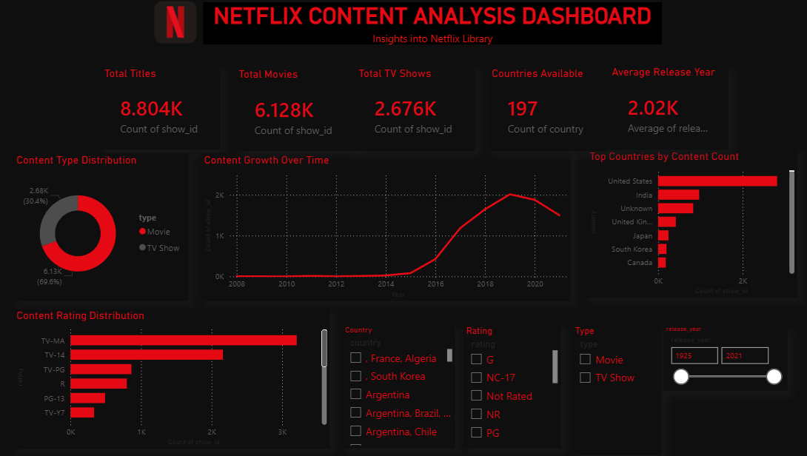
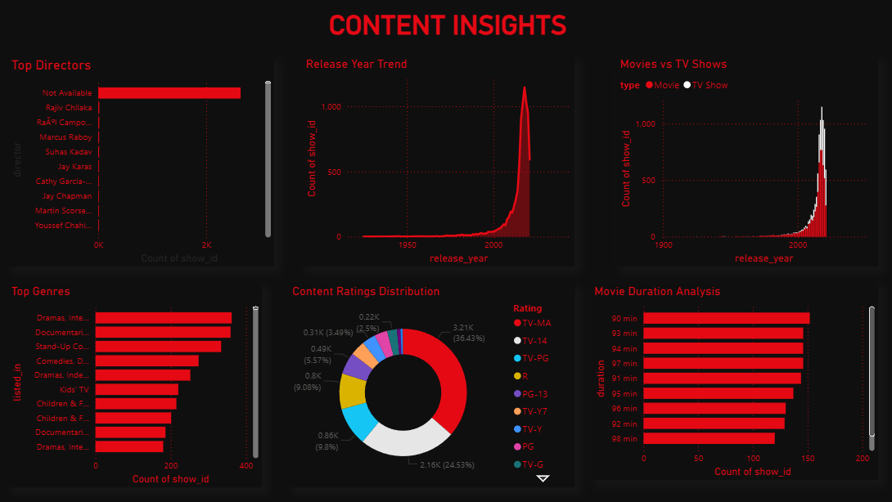
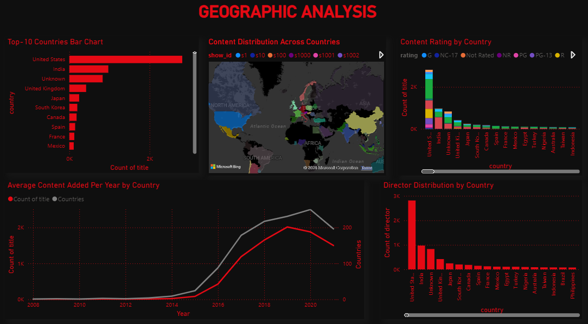

# Netflix Content Analysis Dashboard

## Project Overview

This project analyzes Netflix content using Power BI. The dashboard provides insights into content distribution, ratings, genres, release trends, and geographic availability across countries.

## Objectives

- Analyze Netflix Movies and TV Shows
- Identify content trends over time
- Explore genre popularity
- Examine ratings distribution
- Analyze country-wise content availability

## Tools Used

- Power BI
- Microsoft Excel
- CSV Dataset
- Data Cleaning

## Dashboard Pages

### 1. Overview
KPIs and high-level Netflix statistics.

### 2. Content Insights
Genre analysis, ratings analysis, and release trends.

### 3. Geographic Analysis
Country-wise content distribution and regional insights.

## Key KPIs

- Total Titles
- Total Movies
- Total TV Shows
- Average Release Year
- Total Countries

## Dataset Source

Netflix Titles Dataset from Kaggle.

## Dashboard Screenshots

### Overview

### Content Insights

### Geographic Analysis

## Author

Nikitha
Aspiring Data Analyst
